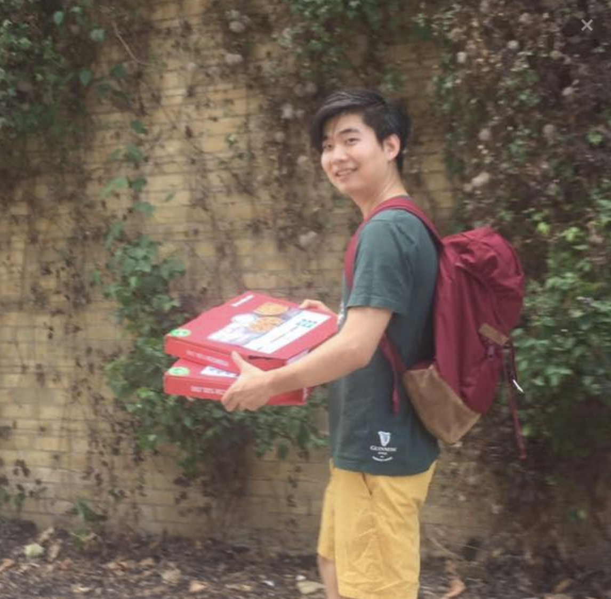
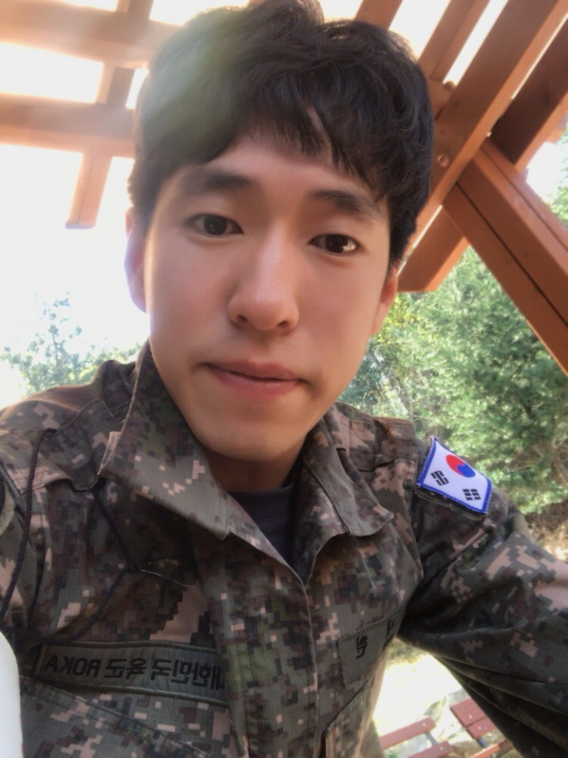
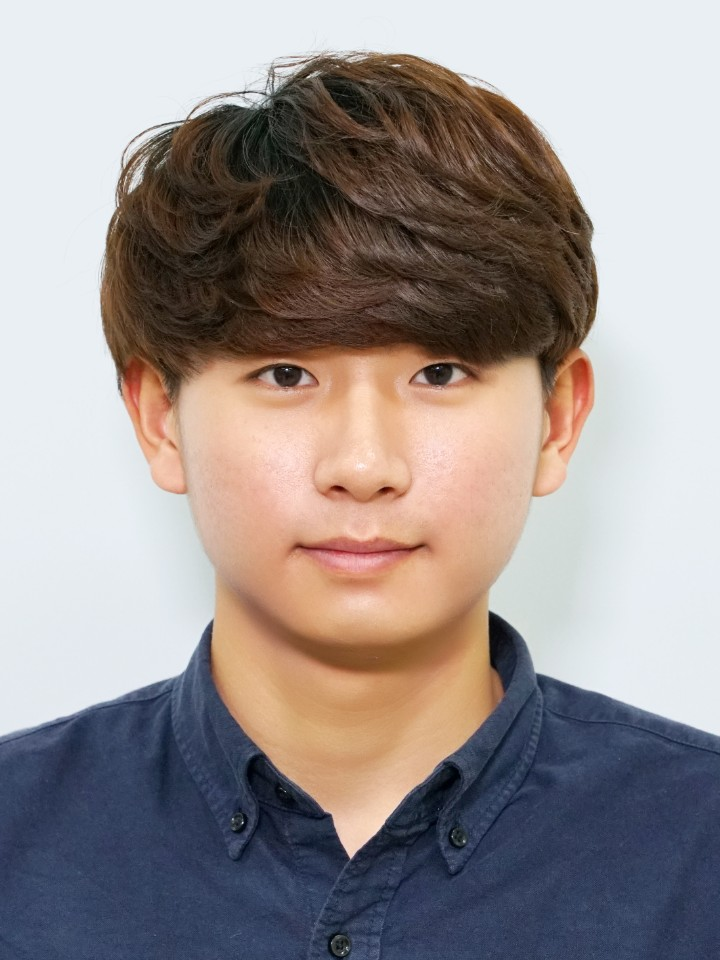
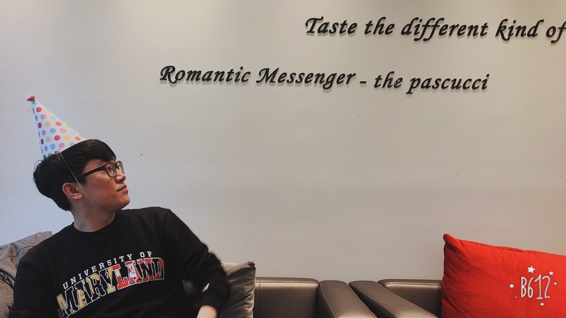

"제목"을 클릭하시면 발표 자료를 보실 수 있습니다.
       

|번호|발표 유형|이름|소속|제목|발표 소개|
|:--------:|:-----------------:|:-----------:|:--------:|:--------:|
|1|키노트|서희|LG전자|데이터 사이언티스트가 인공지능 서비스(Chatbot)를 오픈하는 방법(챗봇과 텍스트 마이닝)|본 세션은 지난 1년간 챗봇 서비스 오픈 통해 경험한 내용을 공유하고 자연어 처리 관점에서 상용 서비스를 위한 핵심요소들을 설명합니다. 마지막으로 텍스트 분석 방법을 통해 효율적인 챗봇 설계와 운영방법을 설명합니다.|
|2|키노트|임재수|카카오|[khaiii - 딥러닝 기반 형태소 분석기](./data/khaiii2.pdf)|카카오의 딥러닝 기반 형태소 분석기 khaiii에 대해 소개를 드립니다. **대상** : RNN, CNN 등 딥러닝 기술을 이용해 품사 태깅, 개체명 인식 등의 NLP 문제를 해결해 보신 분.[발표 동영상](https://www.youtube.com/watch?v=NV5rjDRCebk&t=189s) |
|3|키노트|고병일|카카오|[스마트 스피커에서의 음악 재생 발화 오류 교정](./data/smartspeaker2.pdf)|스마트 스피커에서의 음성인식 오류, 특히 음악 재생 발화에 대한 오류 유형들을 알아보고, 이를 해결할수 있는 방법에 대해서 알아보고자 합니다.|            
|4|튜토리얼|이광춘|Tidyverse Korea|[유튜브 댓글 텍스트 분석](https://statkclee.github.io/text/langcon-2019-tutorial.html?fbclid=IwAR3D2C2NzOUd5y9-dSFYvNzWqKAU3v2b5K0604WGJLMqVn32V0oZ6fvpX0o)|유튜브 API를 통해 유튜브 채널, 동영상, 댓글을 수집하는 방법과 탐색적 데이터 분석을 통해 유튜브 채널 활동지표를 이해하고 댓글을 추출하여 가장 인기있는 댓글러를 찾아보고 자연어 처리를 통해 추가로 텍스트에 숨겨진 깊은 뜻을 함께 찾아봅니다. **대상** : 중급|  
|5|튜토리얼|최태균|모두의 연구소 DeepNLP랩| [텐서플로우로 시작하는 텍스트 분류](https://colab.research.google.com/drive/1gtPt0ecZ6f3xx2SL6EYdTt1xVm7JcLPM)|**1.** 텐서플로우 에스티메이터 기능과 네이버 영화 평점 데이터를 활용하여 텍스트 분류모델을 쉽게 만들어 보아요. **2.** 다음과 같은 내용에 대해서 학습하실 수 있습니다. - 학습 데이터를 어떻게 가공하는지를 알아봅니다. - 텐서플로우 에스티메이터를 어떻게 다루는지 알아봅니다. - 텍스트 분류를 위한 딥러닝 모델을 알아봅니다. **3.** 위 강의는 '텐서플로우와 머신러닝으로 시작하는 자연어처리 (부제: 로지스틱부터 트렌스포머까지)' 를 바탕으로 내용구성이 됩니다. 4. 파이썬과 주피터 노트북을 다루실 줄 아시는 분일 수록 배우시기 편합니다. **대상** :  개발레벨은 초,중급 수준이고 텐서플로우로 텍스트 분류 모델을  간단하게 만들고자 하는 분들게 권하는 튜토리얼입니다.|     
|6|튜토리얼|박조은|Youtube todaycodes [오늘코드](https://www.youtube.com/channel/UCLR3sD0KB_dWpvcsrLP0aUg )|[청와대 국민청원 데이터로 파이썬 자연어처리 입문하기](https://github.com/corazzon/petitionWrangling)|지난해 파이콘에서 진행했던 튜토리얼을 다시 진행합니다. 1년 치 국민청원 텍스트 데이터를 전처리, 분석, 시각화(워드 클라우드, 단어 유사도) 해봅니다. 전처리한 텍스트를 바탕으로 평균보다 높은 투표수를 얻을지 낮은 투표수를 얻을지 머신러닝을 통해 예측해 봅니다. 또, 텍스트를 통해 어느 카테고리에 해당하는 내용인지도 예측해 봅니다. **준비사항** Colaboratory 사용을 위한 구글 이메일 주소와 개인 노트북이 필요합니다. [발표 동영상](https://goo.gl/v28GxC)|      
|7|튜토리얼|강창훈|(주)비긴메이트 / Microsoft AI MVP|[LUIS 머신러닝 자연어처리 기반 챗봇 개발 및 서비스하기](./data/kangchanghun.pdf)|마이크로소프트 Software Bot 개발 프레임워크인 Bot Framework을 이용해 심플 챗봇을 개발해보고 Azure Cloud기반 Azure Bot Service(PaaS)를 통해 챗봇을 서비스하는 전과정을 빠르게 경험한 후 Azure 인공지능 활용기술인 Azure Cognitive Service의 머신러닝 기반 자연어처리 기술인 LUIS를 이용한 인공지능 챗봇을 개발하고 서비스는 전반적인 절차를 Hands On Lab방식으로 빠르게 경험해볼수 있는 과정입니다. 참고 자료는 [여기](http://mixedcode.com/Article/Index?aidx=7732)에 나누어서 업데이트 됩니다.| 
|8|스피커|이재석|SEnE|[자연어처리가 뭔가요? 왜 회사들에서 관심을 가지나요?](./data/whatisnlp.pdf)| 이제 처음으로 자연어처리라는 것을 들으신 분들에게  어떻게 공부하고 무엇을 공부하면 좋을지 생각하는 시간을 갖고자 합니다. 자연어처리 입문에 도움이 되도록 설명을 위한 이미지와 동영상을 많이 준비하고 있습니다. 누구라도 자연어처리를 하는 세상이 빨리 왔으면 좋겠습니다. **대상** : 초급(문과, 비개발)|                 
|9|스피커|박혜웅|SK플래닛|[DIY 챗봇](./data/DIY.pdf)|챗봇 프레임워크와 딥러닝  없이, 나만의 챗봇을 만들 수 있는 방법에 대해 알아봅니다. 대화 관리(Dialogue Manager)와 자연어 이해(NLU)를 위주로 설명합니다. **대상** : 개발자 + 초급|
|10|스피커|심상진|심플랙스컴플랙서티그룹운영자|[한국어 의존성 분석을 위한 이론 및 동향](./data/Parser.pdf)|한국어 의존성 분석을 위한 동향 및 이론들을 알아본다 **대상** : 중급| 
|11|스피커|우종하|챗봇 개발자 모임 페이스북 그룹 운영자|[사례 중심으로 본 감성챗봇의 미래](./data/emotionchat.pdf)|감성챗봇의 현황과 제품 소개 및 특징 분석  **대상 : 초급**|
|12|스피커|고재선|법무법인 신율|[트랜스퍼 러닝과 텍스트 문서의 분류](./data/TransferLearning.pdf)|트랜스퍼 러닝을 텍스트 문서 분류에 적용하는 방법을 간략히 소개합니다. 주요 내용 : **1.** 트랜스퍼 러닝, 문서 분류의 각 일반론 **2.** 소스와 타겟의 분포가 다를 경우의 트랜스퍼 러닝 적용(예컨대, 소스에는 중복되는 클래스가 적고, 타겟에는 중복 클래스가 많은 경우) **3.** 소스와 타겟의 도메인 자체가 다를 경우의 트랜스퍼 러닝 적용(예컨대, 소스는 뉴스이고, 타겟은 영화 리뷰일 경우) **대상** : 초중급|
|13|스피커|서범석|직방|[뉴스 및 커뮤니티 데이터를 이용한 주식시장 예측모델](./data/Seobeomseok.pdf) |뉴스 , 레딧 등 텍스트 데이터를 수치화와 주식시장 반영 **대상** : 초급|
|15|스피커|김준민|카페24|[리뷰에는 이미 별점이 있는데, 또 별점을 학습해서 뭘 하나요](./data/jmkim.pdf)|**1.** 리뷰에는 이미 사용자가 매긴 별점이 있는데, 이걸 딥러닝으로 예측하는 게 무슨 쓸모가 있을까요? 별점이란 무엇일까요? 2) 예쁘게 예측모델을 만들었어요. 그런데 GPU는 누가 지키죠. 귀찮은 일을 피하려면 자연어 처리를 심도 얕게 해야 합니다. **대상** : 초급|
|14|스피커|김준혁|연세대학교 치과대학 치의학교육연구센터|[R에서 텍스트 분석과 RcppMeCab](./data/Rcpp2.pdf)|한글 텍스트 분석 과정에서 형태소 분석을 진행할 것인지는 앞으로도 과제로 남을 것이다. 도메인, 분석 방법에 따라 형태소 분석 여부와 그 정도는 달라질 것이기 때문이다. 본 발표는 RmecabKo와 RcppMeCab이라는 R에서 한글 형태소 분석을 제공하는 패키지 개발 과정과 향후 과제를 개괄적으로 소개하여 위 질문에 답해보려 한다. 더불어 굳이 Python이 아닌 R에서 텍스트 분석을 하는 이유를 실례를 통해 살펴볼 것이다. **대상**: R package에 대한 이해와 Hadley Wickham의 tidy principle, tidyverse package를 알고 있거나 관심이 있는 연구자 또는 분석가, 학생 등|
|15|스피커|정건용, 신민철|아주대학교 e-business학과|[메세지(기사)와 메신저(기사 전달자)를 활용한 가짜뉴스 판별기 제작기](./data/fakenews.pdf)|최근 문제가 되고있는 가짜뉴스를 판별할 수 있는 여러가지 Feature를 찾고, 가짜뉴스에 대한 통합적인 접근을 통해 가짜뉴스를 분류하는 알고리즘 프로세스 제안 **대상** : 초중급|
|16|스피커|홍지민|홍지민(아주대학교), 곽현석(충북대학교)|[1인 미디어를 위한 자동 하이라이트 알고리즘](./data/1media.pdf)|인터넷 방송 채팅창 내 유저들의 반응: 탄성과 감탄사를 통해 방송의 가장 재미있거나, 하이라이트였던 부분을 예측합니다! **대상** : 초중급|
|17|스피커|남내현, 장정우|한림대학교| [너의 목소리가 들려](./data/yourvoice.pdf)|광화문 1번가 플랫폼에서 어떤 키워드에 대한 정책 제안들이, 긍정과 부정 중 어떤 방향으로 서술되었는지 분석하였다. 이러한 분석 결과가 실제로 정부와 국회 입법안으로 피드백되었는지 확인하여, 광화문 1번가가 국민들의 이슈를 수렴하는 커뮤니티적인 기능을 효과적으로 수행하였는지 분석한다. **대상** : 초급. [코드](https://github.com/songys/2019LangCon/blob/master/code.ipynb)|
|18|스피커|고동현|서울대학교 국문과|[문장 속 단어](./data/KohDonghyun_02.pdf)|언어를 다루는 자연어처리 분야와 언어학은 밀접한 관계입니다. 따라서 언어학의 영역인 형태론, 통사론, 의미론 등이 개괄적으로 어떤 내용인지 아는 것은 생각지 못한 직관을 제공할 것입니다. 또한 언어학적 지식을 자연어처리에 적용한다면 실제로 어떤 성과를 기대할 수 있을지 이야기합니다.|
|19|포스터|구윤제, 정민|한림대학교 디지털인문예술전공| [빌보드 차트 뽀개기 : 연도별 GGL 분석](./data/billboard.pdf)|빌보드 차트를 장르, 성별, 가사에 초점을 맞춰서 파이썬을 통한 자연어처리로 분석하였습니다.|
|20|포스터|박형민, 이상규|한림대학교 디지털인문예술전공| [파이썬으로 한림학보 분석한 한림 대학교의 키워드](./data/keyword.pdf)|한림학보 키워드 분석 및 시각화|

# 행사 진행

|:--------:|:-----------------:|:-----------:|:--------:|:--------:|
|송영숙|이상열|홍수린|송치성|한수미|
|이재석|김성근|심지수|고하경|안유미|
|정민|현예은|김지인|박형민|김도경|
|박신홍|김강민|이상규|구윤제|박조은
김건희|심상진

