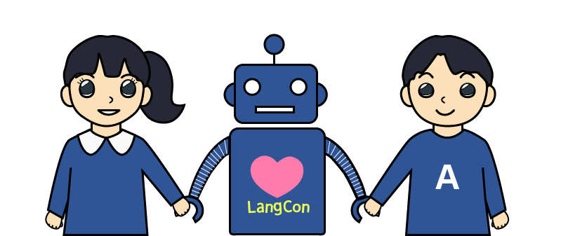
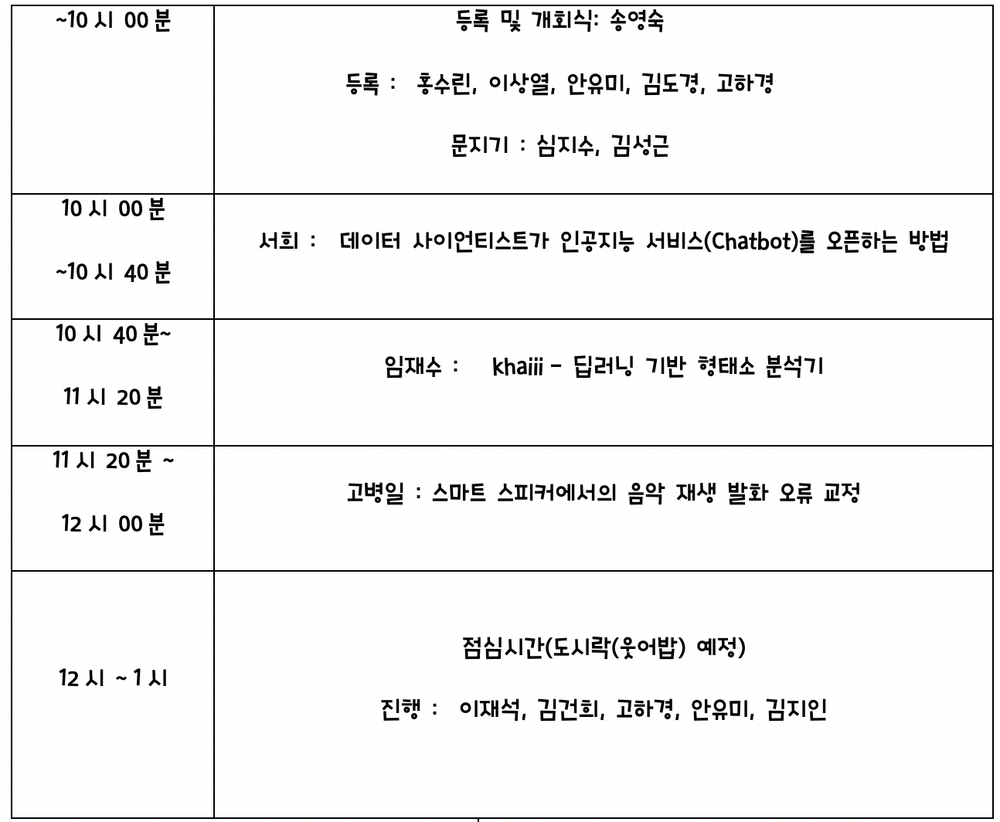
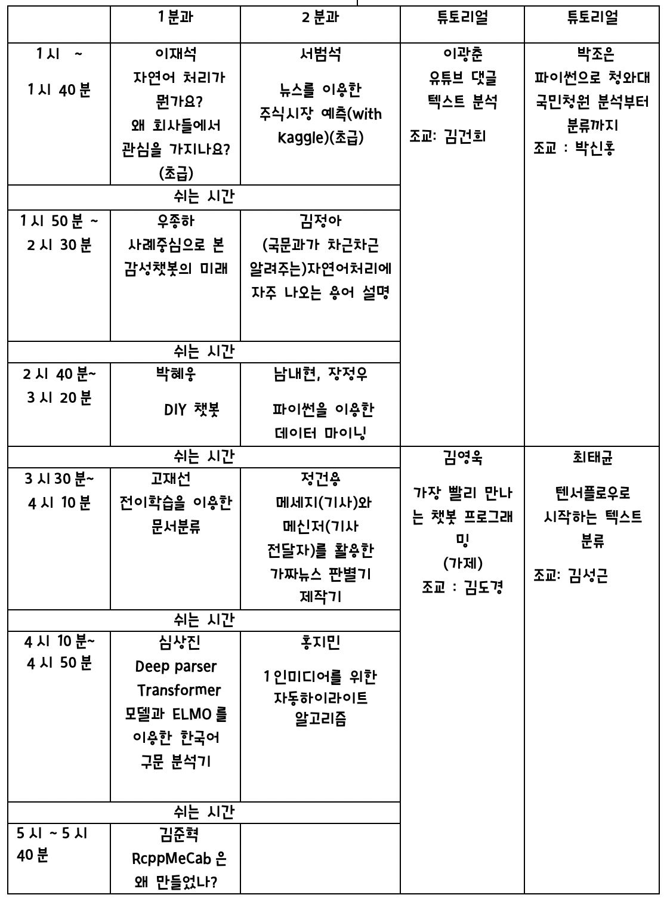
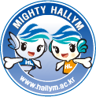

---
# Feel free to add content and custom Front Matter to this file.
# To modify the layout, see https://jekyllrb.com/docs/themes/#overriding-theme-defaults

layout: home
---

                  

 

문과와 이과가 그리 먼 사이가 아니었음을 알리고 싶습니다. 그래도 문맥자유이론을 발표하신다면 좀 쉽게 풀어서 설명해 주시면 좋을 듯 합니다. 코드실습은 R, python으로 준비해 주시면 좋겠습니다. 참여하실 모든 분들 잘 부탁드립니다. 2명이 오거나 200명이 오거나 소외되는 사람 없이 모두가 참여하는 모임이 되는 것이 모토입니다.

  >-    형태소 분석, 구문 분석 등과 챗봇 응용 사례 등을 통해 최근 자연어처리 동향 이해
  >-    대학(원)생들의 다양한 아이디어 공유 및 커뮤니티 모임      
  >-    텍스트 데이터에 쉽게 접근할 수 있도록 하는 튜토리얼        
  >-    텍스트 시각화 등으로 시각적이고 직관적으로 데이터에 접근할 수 있는 기회 마련         

#  2019/2/16(토)                

### 키노트 세션                

          

### 발표 및 튜토리얼 세션 
(담당: 1분과:현예은,  2분과:이상규, 튜토리얼1:구윤제, 튜토리얼2:정민, 박형민)                               
        

### 포스터 세션                    
박형민 · 이상규: 파이썬으로 한림학보 분석한 한림 대학교의 키워드            
정민 · 구윤제: 빌보드 차트 뽀개기 : 연도별 GGL 분석(초급) , 빌보드 차트를 장르, 성별, 가사에 초점을 맞춰서 파이썬으로 분석하였습니다.                 
                     
          

# 찾아 오시는 길           
서울특별시 종로구 중학동 19 더케이트윈타워 A동 11층                            

# 지난 대회 보기          
[멜팅팡_연합세미나](https://www.onoffmix.com/event/110570)                   
[사람이 챗봇을 만듭니다!](https://www.onoffmix.com/event/124842)            
 >[발표 동영상](https://www.youtube.com/playlist?list=PLqkITFr6P-oRQu0OJCIqHuff-ubbCkWlL)                   

[봇봇봇](https://www.onoffmix.com/event/89407) 

# 후원               
[한림대학교 소프트웨어중심대학사업단](http://hlsw.hallym.ac.kr)                            
[한림대학교 디지털인문예술전공](https://sites.google.com/view/dah-hallym)            
         

[Microsoft Learn](https://docs.microsoft.com/ko-kr/learn)         
              
