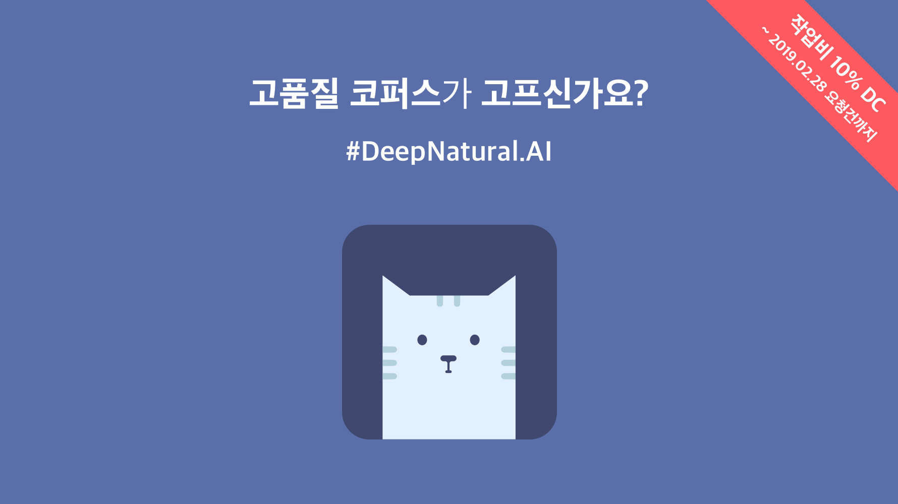
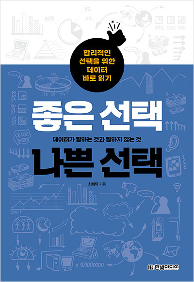
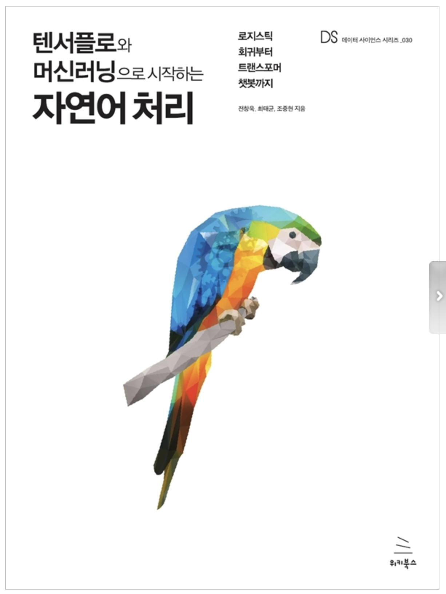
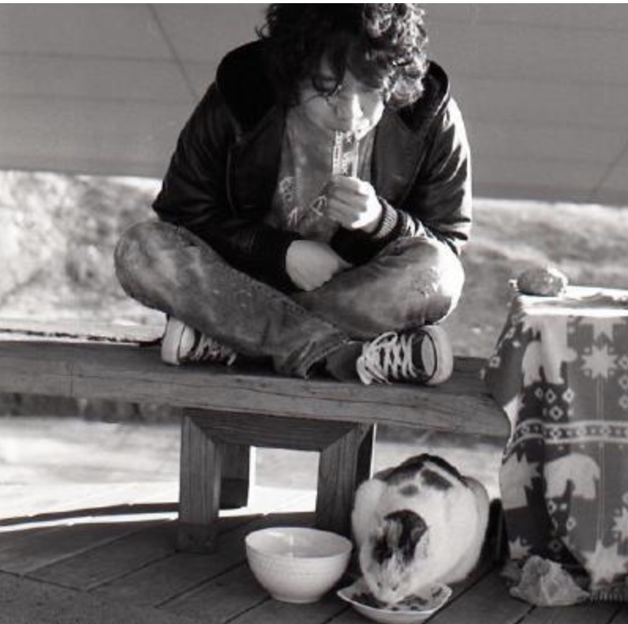

---
# Feel free to add content and custom Front Matter to this file.
# To modify the layout, see https://jekyllrb.com/docs/themes/#overriding-theme-defaults

layout: home
---

                  

 
 

학부 학생부터 현장 전문가까지 공부하면서 또는 일하면서 틈틈이 준비했습니다. 발표 전문가는 아닙니다. 잘 못할 때는 토론하면서 알려 주세요! 실수하면 박수 부탁드립니다. 하루의 발표지만 조금 더 나아지기 위해서 모였으면 좋겠습니다. 이 모임은 3명이 오거나 300명이 오거나 소외되는 사람 없이 모두가 참여하는 모임이 되는 것이 모토입니다. 
      

#  2019/2/16(토)                

### 키노트 세션                

          

### 발표 및 튜토리얼 세션 
(담당: 1분과:현예은,  2분과:이상규, 튜토리얼1:구윤제, 튜토리얼2:정민, 박형민)                               
        

### 포스터 세션(종일 전시, 점심 시간을 이용하여 토론할 수 있습니다.)                    
박형민 · 이상규: 키워드로 본 대학신문 - 한림학보를 파이썬+형태소 분석기로 분석했습니다(초급).          
정민 · 구윤제: 빌보드 차트 뽀개기 : 연도별 GGL 분석(초급) , 빌보드 차트를 장르, 성별, 가사에 초점을 맞춰서 파이썬으로 분석하였습니다.                         

# 찾아 오시는 길           
서울특별시 종로구 중학동 19 더케이트윈타워 A동 11층                            

# 지난 대회 보기          
[멜팅팡_연합세미나](https://www.onoffmix.com/event/110570)                   
[사람이 챗봇을 만듭니다!](https://www.onoffmix.com/event/124842)            
 >[발표 동영상](https://www.youtube.com/playlist?list=PLqkITFr6P-oRQu0OJCIqHuff-ubbCkWlL)                   

[봇봇봇](https://www.onoffmix.com/event/89407) 

# [오늘 행사에 대한 의견을 들려 주세요!](http://aka.ms/devsurveyKR) 

# 후원                       

[Microsoft Learn](https://docs.microsoft.com/ko-kr/learn)            

[한림대학교 소프트웨어중심대학사업단](http://hlsw.hallym.ac.kr)                              
[한림대학교 디지털인문예술전공](https://sites.google.com/view/dah-hallym)            
 

[DeepNatural](https://deepnatural.ai)

DeepNatural AI - 딥네츄럴은 고품질 자연어 학습 데이터를 전문적으로 수집 / 가공하는 자연어처리 스타트업입니다. 먹을 줄 아는 사람이 맛집을 아는 것처럼, NLP 하는 사람들이 좋은 학습 데이터를 압니다. 텍스트, 음성, 그리고 영상까지. 장인 정신으로 데이터를 가공하고 검수합니다. 고품질 코퍼스 구축은 저희를 전적으로 믿으셔야 합니다.

[한빛미디어](http://www.hanbit.co.kr/)        
                  

[최희탁 저(2019), 좋은선택 나쁜 선택](http://www.kyobobook.co.kr/product/detailViewKor.laf?ejkGb=KOR&mallGb=KOR&barcode=9791162241400&orderClick=LEA&Kc=)                
누구나 쉽게 읽을 수 있도록 배려한 '데이터 바로 읽기' 법 교양서
                                   
                             
                
[위키북스](http://wikibook.co.kr/)                             
                         
전창욱, 최태균, 조중현 저(2019), [텐서플로와 머신러닝으로 시작하는 자연어 처리](http://www.yes24.com/24/goods/69334316?scode=032&OzSrank=1&fbclid=IwAR1pL7jjtA1MuT-iRvm6yZvl2SKzED5W5nC86T2kCOvKD_IOMbhrti7ggpE)                            
           
   

# 개인 후원

|이름|자기 소개|자연어 처리에 바란다!|Github / blog |
|:--------:|:-----------------:|:-----------:|:-----------:|
|송영숙|코딩을 좋아하는 국어학 전공자입니다.|모임을 준비하면서 의도치 않은 일들이 일어나고 어느 순간 허무하다고 느낄 수도 있을 거라고 생각했는데 다행히 멋진 운영진과 스태프, 발표자들의 도움으로  진행할 수 있었습니다. 감사합니다. 문과와 이과가 그리 먼 사이가 아니었음을 알리고 싶었는데 함께 모여서 한국어 자연어처리를 의논하는 날이 생긴 것을 자축합니다.| Github : [https://github.com/songys](https://github.com/songys)|    
|김현중|효율적인 데이터 분석과 한국어 자연어처리에 관심 많은 분석가 입니다.| 데이터 분석이나 딥러닝 분야에서 크고 작은 모임들이 생길 때 부러워만 했는데, 자연어처리도 이러한 모임이 생겼다니 기쁩니다. 랭콘을 준비해주셔서 감사하고, 자연어처리 커뮤니티도 탄탄하게 자라났으면 좋겠습니다.|  github : [https://github.com/lovit/](https://github.com/lovit/)     blog : [https://lovit.github.io/](https://lovit.github.io/)|
|박조은|주변에 있는 텍스트를 찾고 분석하는 것을 좋아합니다.|파이썬과 여러 라이브러리, 그리고 다양한 커뮤니티를 통해 텍스트 분석의 재미를 느끼게 되었습니다. 더 많은 분들과 텍스트 분석을 함께 해보고 싶습니다.|GitHub : [https://github.com/corazzon](https://github.com/corazzon)|

